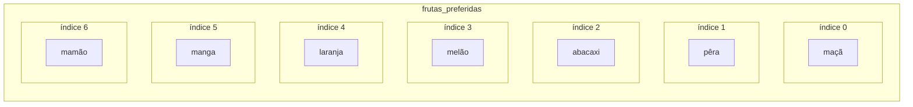
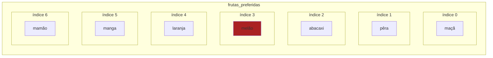

<!-- Marcação de hightlight de código conforme https://gohugo.io/content-management/syntax-highlighting/ -->

<!-- Esse cabeçalho precisa ser em formato html para excluí-lo da TOC (TODO: encontrar solução melhor) -->
<h2> Conteúdo </h2>


A lista linear é uma estrutura de dados que consiste em uma sequência de elementos armazenados em locais adjacentes na memória (ou seja, uma alocação contígua, como em um array). Essa estrutura permite não apenas o acesso sequencial aos elementos, como também o acesso direto por meio de seus endereços de memória, o que torna a busca e a recuperação de elementos eficientes.

Para exemplificar, imaginemos a seguinte situação, uma lista com as sete (7) frutas preferidas de alguém, nessa lista estão presentes maçã, pêra, abacaxi, melão, laranja, manga e mamão. Em python, para criar uma lista como essa, executamos o comando a seguir:



```python
frutas_preferidas = ['maçã', 'pêra', 'abacaxi', 'melão', 'laranja', 'manga', 'mamão']
```



Internamente a memória do computador é organizada com sete endereços de memória que referenciam cada uma dessas frutas, que chamamos de índices, esses índices são contados a partir de zero (0) e portanto no endereço de índice 0 encontraremos a maçã, no endereço de índice 1 encontraremos a pêra e daí em diante, até encontrarmos o mamão no último endereço, de índice 6. Ilustrando essa organização temos a figura a seguir:



É importante frisar que frutas_preferidas é composto por um bloco único na memória, endereçado pelo mesmo endereço do índice 0 e contendo nesse mesmo bloco todos os itens dos demais índices, não havendo separação ou espaço de memória entre esses itens. Essa é uma característica fundamental para compreender as vantagens e desvantagens de uma alocação contígua e em quais situações a empregamos.

## Vantagens

- **Acesso direto aos elementos:** Como cada elemento é armazenado em uma posição de memória contígua e possui um endereço único, o acesso aos elementos é direto e eficiente, com tempo de acesso constante, ou seja, o acesso aos dados de uma lista através dos índices terá sempre complexidade O(1). Esse acesso pode ser feito como demonstrado:



```python {linenostart=2}
# Escreve na tela o conteúdo referenciado pelo quarto endereço, ou seja, o índice 3
print(frutas_preferidas[3])

melão
```



Ao realizar essa operação, o que ocorre é a leitura direta do conteúdo referenciado pelo índice 3, sem ter que percorrer a lista ou consultar dados em outros endereços de memória.


- **Operações de busca e recuperação rápidas:** A busca e recuperação de elementos em uma lista linear são geralmente rápidas, como vimos anteriormente, especialmente quando se conhece a posição do elemento na lista. Caso a posição não seja conhecida, em listas de tamanho pequeno e médio pode-se realizar buscas lineares e em outros casos, pode-se também implementador algoritmos como a busca binária, desde que a lista esteja ordenada.

Para melhor ilustrar como fazer buscas lineares em listas com Python, imagine que queiramos retornar o endereço do item "laranja", que não conhecemos. Nesse caso podemos utilizar a funções `index( )` ou `find( )`, ou até mesmo implementarmos uma busca nós mesmos. Para mais informações sobre os diferentes tipos de algoritmos de buscas e suas características, leia a seção // TODO: seção de algo. de busca.



```python{linenostart=6}
# Escreve na tela o endereço do item "laranja" através das buscas embutidas de python e uma busca implementada pelo autor
# index() retorna o índice pertencente ao item buscado
print(frutas_preferidas.index("laranja")
# find() faz a mesma coisa, porém retorna um índice -1 caso não encontre o item
print(frutas_preferidas.find("laranja")
# Esse último método é mais flexível pois permite realizar buscas em objetos mais complexos, podendo utilizar seus campos como parâmetro de busca
for i in range(len(frutas_preferidas)):
  if frutas_preferidas[i] == "laranja":
    print(i)

4
4
4
```



- **Implementação eficiente de pilhas e filas:** Em certos casos, a implementação de pilhas e filas usando listas lineares é eficiente, pois permite a inserção e remoção de elementos em tempo constante, O(1), sem a necessidade de realocação de memória sempre que o número máximo de elementos for conhecido. Nas seções dessas estruturas de dados veremos sua implementação valendo-se da lista padrão do Python.

## Desvantagens

- **Tamanho fixo:** A alocação contígua de elementos em uma lista linear pode levar a um tamanho fixo da lista, o que pode ser inconveniente quando há a necessidade de variar dinamicamente o número de elementos. Nesses casos seria necessária a realocação de memória e ajustes na estrutura da lista, o que pode ser custoso em termos de tempo e recursos.

- **Inserção e remoção ineficientes:** A inserção e remoção de elementos em uma lista linear podem ser ineficientes em termos de tempo, especialmente quando é necessário inserir ou remover elementos no meio da lista. Isso pode exigir o deslocamento de elementos subsequentes, resultando em tempo de execução proporcional ao tamanho da lista, O(n).

- **Desperdício de memória:** Se a lista linear não for totalmente preenchida, pode-se dizer que há desperdício de memória, pois os locais de memória não utilizados permanecem reservados, o que pode resultar em uso ineficiente da memória.

## Usos comuns

- **Armazenamento de dados sequenciais:** A lista linear é útil quando se deseja armazenar e acessar elementos em uma sequência específica, como uma lista de itens em uma compra online, registros em um banco de dados ou pixels em uma imagem. É importante frisar que esse tipo de lista desepenha melhor quando o número de elementos já é conhecido no momento da alocação.

- **Implementação de outras estruturas de dados:** É possível implementar, por exemplo, pilhas (LIFO) e filas (FIFO) usando listas lineares com alocação contígua. Nesse caso, o que diferenciará essas estruturas da lista linear serão as operações específicas que cada uma desempenha.

## Operações típicas

- **Inserção:** Adicionar um novo elemento à lista em uma posição específica, como no início ou em uma posição intermediária pode exigir o deslocamento de elementos subsequentes para acomodar o novo elemento, o que pode afetar o desempenho da operação. Inserções no final da lista geralmente não impactam o desempenho, a não ser que o número máximo de elementos tenha sido atingido, nesse caso a inserção exigirá uma realocação da lista que impactará o desempenho da operação.

- **Remoção:** A exclusão de um elemento específico da lista pode exigir o deslocamento de elementos subsequentes para preencher o espaço vago e manter a continuidade da lista, o que também pode afetar o desempenho da operação.

- **Busca:** Localizar a posição de um elemento específico na lista com base em seu valor pode ser realizada de forma sequencial, percorrendo a lista elemento por elemento, ou de forma otimizada, como por meio de uma busca binária, dependendo da ordenação dos elementos na lista.

- **Acesso:** Recuperar o valor de um elemento em uma posição específica da lista com base em seu índice é uma operação direta e eficiente, entretanto recuperar um valor com base em algum outro dado pode exigir também uma operação de busca.

Além dessas operações básicas, outras operações mais avançadas podem ser implementadas em uma lista linear, como ordenação, concatenação, particionamento e inversão, dependendo dos requisitos específicos de cada aplicação.

## Utilização da lista linear em python

A lista é uma das estruturas de dados mais versáteis e amplamente utilizadas em Python, não sendo necessário implementá-la, pois já é uma parte fundamental da biblioteca padrão da linguagem. Para criar uma lista em Python, você pode usar colchetes ` [ ] ` e separar os elementos por vírgulas. Por exemplo:



```Python
# Criando uma lista de números inteiros
numeros = [1, 2, 3, 4, 5]

# Criando uma lista de strings
frutas = ['maçã', 'banana', 'laranja']
```




Uma característica importante das listas é a capacidade de conter diferentes tipos de elementos, como números, strings, booleanos e até mesmo outras listas. Além disso, as listas em Python são indexadas, o que significa que você pode acessar elementos individuais pelo seu índice, começando por 0 para o primeiro elemento. Por exemplo:



```Python {linenostart=6}
# Acessando elementos em uma lista pelo índice
print(numeros[0])  # Saída: 1
print(frutas[1])    # Saída: 'banana'
```




As listas da biblioteca padrão de Python também suportam índices negativos, o que permite acessar elementos a partir do final da lista. O índice -1 representa o último elemento, -2 representa o penúltimo e assim por diante. Por exemplo:



```Python {linenostart=9}
# Acessando elementos em uma lista com índices negativos
print(numeros[-1])  # Saída: 5
print(frutas[-2])    # Saída: 'banana'
```




Outra operação comum em listas é a fatiamento (slicing), que permite extrair uma parte específica da lista com base em um intervalo de índices. O fatiamento em Python é feito usando colchetes e dois pontos ` : ` para separar os índices inicial, final e o passo. Por exemplo:



```Python {linenostart=12}
# Fatiamento de listas
print(numeros[1:4])    # Saída: [2, 3, 4]
print(frutas[:2])      # Saída: ['maçã', 'banana']
print(numeros[::2])    # Saída: [1, 3, 5]
```




As listas em Python também possuem uma ampla variedade de métodos embutidos que podem ser usados para realizar várias operações, como adicionar elementos com a função `append()`, remover elementos com `remove()`, contar o número de ocorrências de um elemento com `count()`, ordenar os elementos com `sort()` e inverter a ordem dos elementos com `reverse()`, entre outros.

Além disso, as listas em Python são mutáveis, o que significa que você pode modificar seu conteúdo diretamente atribuindo um novo valor a um determinado índice. Por exemplo:



```Python {linenostart=16}
# Modificando elementos em uma lista
numeros[2] = 30  # Altera o valor do terceiro elemento para 30
frutas.append('uva')  # Adiciona 'uva' ao final da lista de frutas
```




Ainda com relação à mutabilidade, uma característica importante das listas é que elas são mutáveis por referência. Isso significa que, se uma lista for atribuída a uma variável e, em seguida, essa variável for atribuída a outra variável, ambas as variáveis estarão referenciando a mesma lista na memória. Portanto, qualquer modificação feita em uma variável afetará todas as outras variáveis que referenciam a mesma lista. Por exemplo:



```Python
# Mutabilidade por referência em listas
lista1 = [1, 2, 3]
lista2 = lista1  # lista2 faz referência à mesma lista que lista1

lista1[0] = 10  # Modifica o primeiro elemento de lista1

print(lista1)  # Saída: [10, 2, 3]
print(lista2)  # Saída: [10, 2, 3], pois lista2 faz referência à mesma lista que lista1
```




Para criar uma cópia independente de uma lista, é necessário usar o método `copy()` ou a função `list()` para criar uma nova lista com os mesmos elementos. Por exemplo:



```Python
# Criando uma cópia independente de uma lista
lista1 = [1, 2, 3]
lista2 = lista1.copy()  # Cria uma nova lista (cópia) com os mesmos elementos de lista1

lista1[0] = 10  # Modifica o primeiro elemento de lista1

print(lista1)  # Saída: [10, 2, 3]
print(lista2)  # Saída: [1, 2, 3], pois lista2 é uma cópia independente de lista1
```




Em resumo, as listas são estruturas de dados versáteis e poderosas em Python, que permitem armazenar e manipular coleções de elementos de forma flexível. Elas suportam operações de indexação, fatiamento, e têm uma ampla variedade de métodos para realizar operações comuns ao seu tipo. É importante estar ciente da mutabilidade por referência e das possíveis mudanças no tamanho da lista ao fazer modificações. Com um bom entendimento das listas, especialmente em Python, é possível realizar muitas tarefas de processamento de dados de forma conveniente sem abrir mão da eficiência. Para mais informações confira a seção de referências.

## Referências

#### Geral

- <a href="https://duckduckgo.com/?q=Estruturas+de+dados+e+algoritmos+em+C%2B%2B+DROZDEK%2C+Adam" target="_blank">(Livro) Estruturas de dados e algoritmos em C++</a>
- <a href="https://duckduckgo.com/?q=Estruturas+de+dados%3A+algoritmos%2C+an%C3%A1lise+da+complexidade+e+implementa%C3%A7%C3%B5es+em+Java+e+C%2FC%2B%2B&ia=web" target="_blank">(Livro) Estruturas de dados: algoritmos, análise da complexidade e implementações em Java e C/C++</a>
- <a href="https://duckduckgo.com/?q=Introduction+to+Algorithms" target="_blank">(Livro) Introduction to Algorithms</a>

#### Python

- <a href="https://blog.betrybe.com/python/python-list/" target="_blank">Betrybe - Python list: armazenando itens em uma única variável!</a>
- <a href="https://www.devmedia.com.br/como-trabalhar-com-listas-em-python/37460" target="_blank">Devmedia - Como trabalhar com listas em Python</a>
- <a href="https://python-reference.readthedocs.io/en/latest/docs/list/" target="_blank">Python Reference - List</a>
- <a href="https://www.programiz.com/python-programming/list" target="_blank">Programiz - Python List</a>
- <a href="https://docs.python.org/3/tutorial/datastructures.html" target="_blank">Python Docs - More on Lists</a>
- <a href="https://www.w3schools.com/python/python_lists.asp" target="_blank">W3 Schools - Python List</a>
- <a href="https://duckduckgo.com/?q=Use+a+Cabe%C3%A7a!+Python&ia=web" target="_blank">(Livro) Use a Cabeça! Python</a>
- <a href="https://duckduckgo.com/?q=Python+Fluente%3A+Programa%C3%A7%C3%A3o+Clara%2C+Concisa+e+Eficaz" target="_blank">(Livro) Python Fluente: Programação Clara, Concisa e Eficaz</a>
